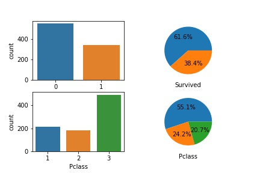
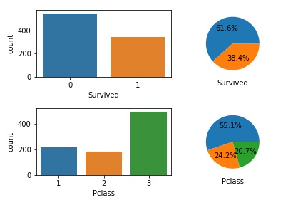

## 在一个figure中画多个subplots

在做EDA和Data Visualization中常常会用到的一个code snippet,在这里以[kaggle上的titianic数据为例子][1]:

```python
# 先导入packages
import pandas as pd
import matplotlib.pyplot as plt
%matplotlib inline
import seaborn as sns
```

```python
# 导入数据
# path需根据具体环境作调节
path = 'input'

train_df = pd.read_csv(''.join([path, '/train.csv']))
test_df = pd.read_csv(''.join([path, '/test.csv']))
gender_sub_df = pd.read_csv(''.join([path, '/gender_submission.csv']))

# 以Survived特征为例子
fig, (ax1, ax2) = plt.subplots(nrows=1, ncols=2)

# ax1
sns.countplot(train_df['Survived'], ax=ax1)

# ax2
# autopct参数是用来显示饼图上百分比的
ax2.pie(train_df['Survived'].value_counts(), autopct='%1.1f%%')
# set_aspect('equal')是为了让饼图成圆形(circle)而不是椭圆(ellipse， oval)
ax2.set_aspect('equal')
plt.set_xlabel('Survived')
```

其中部分代码也可重写为如下：

```python
fig, ax = plt.subplots(nrows=1, ncols=2)

# ax1
sns.countplot(train_df['Survived'], ax=ax[0])

# ax2
ax[1].pie(train_df['Survived'].value_counts(), autopct='%1.1f%%')
ax[1].set_aspect('equal')
plt.set_xlabel('Survived')
```




也可以根据修改`nrows`, `ncols`参数来适用多行多列的情况：(这里举得这个例子只是为了举例而举例，没有过多实际意义)

```python
fig, ax = plt.subplots(nrows=2, ncols=2)

# ax[0, 0]
sns.countplot(train_df['Survived'], ax=ax[0, 0])

# ax[0, 1]
ax[0, 1].pie(train_df['Survived'].value_counts(), autopct='%1.1f%%')
ax[0, 1].set_aspect('equal')
ax[0, 1].set_xlabel('Survived')

# ax[1, 0]
sns.countplot(train_df['Pclass'], ax=ax[1, 0])

# ax[1, 1]
ax[1, 1].pie(train_df['Pclass'].value_counts(), autopct='%1.1f%%')
ax[1, 1].set_aspect('equal')
ax[1, 1].set_xlabel('Pclass')
```




当然也可以用循环来实现，在此不对这举例了。


中间还有2个小插曲，就是我实现的时候，发现`ax[0, 0]`的subplot没有`x_label`,所以还去StackOverflow上面提了个[Question][4]，发现仅仅是被hidden住了，加上一行`plt.tight_layer()`代码即可。

```python
fig, ax = plt.subplots(nrows=2, ncols=2)

# ax[0, 0]
sns.countplot(train_df['Survived'], ax=ax[0, 0])

# ax[0, 1]
ax[0, 1].pie(train_df['Survived'].value_counts(), autopct='%1.1f%%')
ax[0, 1].set_aspect('equal')
ax[0, 1].set_xlabel('Survived')

# ax[1, 0]
sns.countplot(train_df['Pclass'], ax=ax[1, 0])

# ax[1, 1]
ax[1, 1].pie(train_df['Pclass'].value_counts(), autopct='%1.1f%%')
ax[1, 1].set_aspect('equal')
ax[1, 1].set_xlabel('Pclass')

plt.tight_layout(h_pad=1)
```



还有就是hexo插图片时，若用markdown语法，说是文章在首页无法显示图片，点进去后仍可，所以只可采用最好用标签插件语法来实现，例如：


> 


## Reference

[Titanic in Kaggle](https://www.kaggle.com/c/titanic )

[why-is-matplotlib-plotting-my-circles-as-ovals](https://stackoverflow.com/questions/9230389/why-is-matplotlib-plotting-my-circles-as-ovals )

[how-to-set-the-labels-size-on-a-pie-chart-in-python](https://stackoverflow.com/questions/7082345/how-to-set-the-labels-size-on-a-pie-chart-in-python )

[set-xlabel-is-in-invalid-in-ax0-0-when-drawing-4-subplots-in-one-plot](https://stackoverflow.com/questions/55794894/set-xlabel-is-in-invalid-in-ax0-0-when-drawing-4-subplots-in-one-plot)

[How-to-insert-image-in-hexo-post](https://yanyinhong.github.io/2017/05/02/How-to-insert-image-in-hexo-post/)

[1]: <https://www.kaggle.com/c/titanic>	"Titanic in Kaggle"
[2]: <https://stackoverflow.com/questions/9230389/why-is-matplotlib-plotting-my-circles-as-ovals>	"画圆形的plot而不是椭圆形的"
[3]: <https://stackoverflow.com/questions/7082345/how-to-set-the-labels-size-on-a-pie-chart-in-python>	"显示饼图上的百分比"
[4]: <https://stackoverflow.com/questions/55794894/set-xlabel-is-in-invalid-in-ax0-0-when-drawing-4-subplots-in-one-plot>	"ax[0, 0]的subplot的set_xlabel无效"
[5]: <https://yanyinhong.github.io/2017/05/02/How-to-insert-image-in-hexo-post/>	"hexo插入图片"

