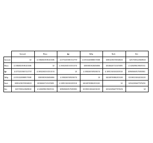

# 将DataFrame中的数据以表格的形式另存为图片

在上次按序输出关联矩阵的blog中有了将DataFrame中的数据以表格形式另存储为图片的想法。

起初，Google了在StackOverflow上找到了[相关问题](<https://stackoverflow.com/questions/35634238/how-to-save-a-pandas-dataframe-table-as-a-png>)，并将代码修改应用于[Titanic的数据](<https://www.kaggle.com/c/titanic>)上，具体如下：

```python
from pandas.plotting import  table

fig = plt.figure(figsize=(5, 6))
ax = fig.add_subplot(111, frame_on=False) # no visible frame
ax.xaxis.set_visible(False)  # hide the x axis
ax.yaxis.set_visible(False)  # hide the y axis

table(ax, train_corr, loc='center')  # where df is your data frame

plt.savefig('correlation_matrix_vague.jpg')
```




但是，发现另存为的图片极为模糊，再思考并查询相关文档未果后，并在StackOverflow上提出了[相关问题](<https://stackoverflow.com/questions/55813270/how-to-make-picture-clear-when-saving-the-table-of-dataframe-as-a-picture>)，发现是因为没有设置合适的`dpi`参数，故设置合适的`dpi`参数并修改代码如下：

```python
from pandas.plotting import  table

fig = plt.figure(figsize=(5, 6), dpi=1400)
ax = fig.add_subplot(111, frame_on=False) # no visible frame
ax.xaxis.set_visible(False)  # hide the x axis
ax.yaxis.set_visible(False)  # hide the y axis

table(ax, train_corr, loc='center')  # where df is your data frame

plt.savefig('correlation_matrix_HD.jpg')
```




# Reference

[在matplotlib的一个figure中画多个subplots]([https://bovenpeng.github.io/2019/04/22/%E5%9C%A8matplotlib%E7%9A%84%E4%B8%80%E4%B8%AAfigure%E4%B8%AD%E7%94%BB%E5%A4%9A%E4%B8%AAsubplots/](https://bovenpeng.github.io/2019/04/22/在matplotlib的一个figure中画多个subplots/))

[How to save a pandas DataFrame table as a png](https://stackoverflow.com/questions/35634238/how-to-save-a-pandas-dataframe-table-as-a-png)

[Titanic in Kaggle](https://www.kaggle.com/c/titanic)

[How to make picture clear when saving the table of DataFrame as a picture](https://stackoverflow.com/questions/55813270/how-to-make-picture-clear-when-saving-the-table-of-dataframe-as-a-picture)

[Relationship between dpi and figure size](https://stackoverflow.com/questions/47633546/relationship-between-dpi-and-figure-size)

[pandas.plotting](<https://pandas.pydata.org/pandas-docs/stable/user_guide/visualization.html#plotting-tools>)

[matplotlib.pyplot.table](<https://matplotlib.org/api/_as_gen/matplotlib.pyplot.table.html?highlight=table#matplotlib.pyplot.table>)

